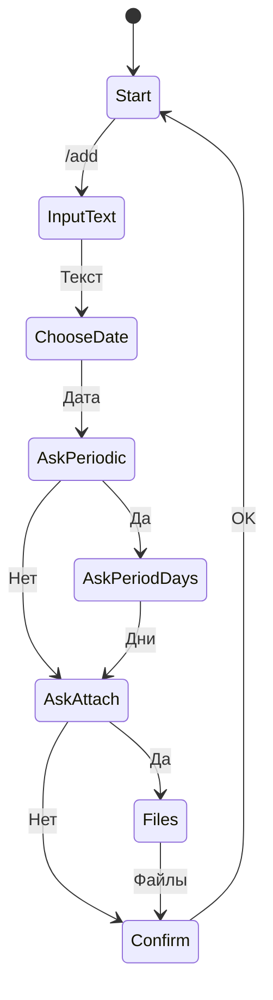
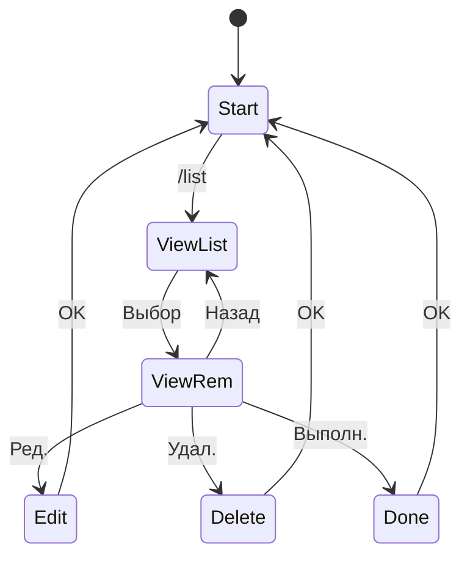
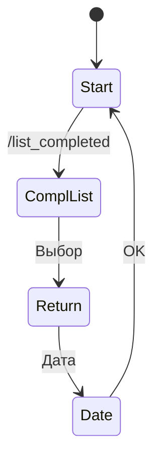

# Проверка о соответствии выполненной работы ТЗ
## Формализация технического задания

В данном документе представлен формальный анализ соответствия разработанного бота-напоминания требованиям технического задания.
Функциональность системы описана в терминах конечного автомата, визуализированного с помощью детализированных блок-схем.

Отчет разделен на 4 ключевых раздела:
- Моделирование поведения с помощью UML-диаграмм
- Формальные сценарии использования
- Матрица прослеживаемости
- Анализ соответствия ТЗ

**Бот предоставляет следующие возможности:**
- Создание напоминаний с текстом, датой и опциональными файлами.
- Поддержка периодических напоминаний с заданным интервалом.
- Редактирование, удаление и отметка напоминаний как выполненных.
- Просмотр текущих и завершённых напоминаний с пагинацией.
- Хранение файлов в Google Drive.

## **1. Моделирование поведения с помощью UML-диаграмм**
### 1. Создание напоминания


---

### 2. Управление напоминаниями


---

### 3. Работа с готовыми напоминаниями


---

## **2. Формальные сценарии использования**
Сценарии использования описывают взаимодействие пользователя с ботом в формате текстовых описаний.

### 1. Создание напоминания
**Название:** Создание нового напоминания

**Описание:** Пользователь создаёт напоминание с текстом, датой и опциональными файлами.

**Шаги:**
1. Пользователь отправляет команду "/создать".
2. Бот запрашивает текст напоминания.
3. Пользователь вводит текст.
4. Бот запрашивает дату.
5. Пользователь вводит дату.
6. Бот спрашивает о периодичности.
7. Пользователь выбирает "Нет"или указывает интервал в днях.
8. Бот запрашивает файлы.
9. Пользователь загружает файлы или выбирает "Нет".
10. Бот сохраняет напоминание и возвращается в начальное состояние.

---

### 2. Прикрепление файлов
**Название:** Добавление файлов к напоминанию

**Описание:** Пользователь прикрепляет файлы к напоминанию.

**Шаги:**
1. Бот запрашивает, нужно ли прикрепить файлы.
2. Пользователь подтверждает загрузку.
3. Пользователь отправляет файлы.
4. Бот загружает файлы в Google Drive.
5. Бот сохраняет ссылки на файлы в напоминании.

---

### 3. Установка периодического напоминания
**Название:** Создание периодического напоминания

**Описание:** Пользователь создаёт напоминание, которое повторяется с заданным интервалом в днях.

**Шаги:**
1. Бот запрашивает у пользователя, нужно ли сделать напоминание периодическим.
2. Пользователь подтверждает, что напоминание должно быть периодическим.
3. Бот запрашивает количество дней для интервала повторения.
4. Пользователь вводит количество дней.
5. Бот создаёт периодическое напоминание с указанным интервалом и сохраняет его.

---

### 4. Просмотр активных напоминаний
**Название:** Просмотр списка активных напоминаний

**Описание:** Пользователь просматривает список текущих напоминаний и может выбрать одно для просмотра деталей.

**Шаги:**
1. Бот находится в начальном состоянии.
2. Пользователь отправляет команду "/list".
3. Бот отображает постраничный список активных напоминаний.
4. Пользователь выбирает одно из напоминаний.
5. Бот показывает подробные данные о выбранном напоминании.
6. Бот отображает кнопки для возможных действий (например, редактирование, удаление, отметка как выполненное).

---

### 5. Редактирование напоминания
**Название:** Редактирование напоминания

**Описание:** Пользователь изменяет текст, дату или файлы напоминания.

**Шаги:**
1. Пользователь выбирает напоминание из списка.
2. Пользователь нажимает "Редактировать".
3. Бот запрашивает новый текст.
4. Пользователь вводит текст.
5. Бот запрашивает новую дату.
6. Пользователь вводит дату.
7. Бот обновляет напоминание.

---

### 6. Удаление напоминания
**Название:** Удаление напоминания

**Описание:** Пользователь удаляет выбранное напоминание из списка активных.

**Шаги:**
1. Пользователь просматривает детали напоминания.
2. Пользователь нажимает кнопку "Удалить".
3. Бот удаляет выбранное напоминание.
4. Бот возвращается к списку активных напоминаний.

---

### 7. Просмотр выполненных напоминаний
**Название:** Просмотр списка выполненных напоминаний

**Описание:** Пользователь просматривает список завершённых напоминаний.

**Шаги:**
1. Бот находится в начальном состоянии.
2. Пользователь отправляет команду "/list_completed".
3. Бот отображает постраничный список выполненных напоминаний.

---

### 8. Хранение файлов
**Название:** Хранение вложений напоминания

**Описание:** Пользователь прикрепляет файлы к напоминанию, и бот сохраняет их в облачном хранилище.

**Шаги:**
1. Пользователь загружает файлы для напоминания.
2. Бот получает файлы.
3. Бот загружает файлы в Amazon S3.
4. Бот сохраняет ссылки на файлы в данных напоминания.

---

### 9. Управление периодическими напоминаниями
**Название:** Удаление текущего экземпляра периодического напоминания

**Описание:** Пользователь удаляет только текущий экземпляр периодического напоминания, сохраняя будущие повторения.

**Шаги:**
1. Пользователь просматривает детали периодического напоминания.
2. Пользователь нажимает кнопку "Удалить текущее".
3. Бот запрашивает подтверждение удаления.
4. Пользователь подтверждает удаление.
5. Бот удаляет текущий экземпляр напоминания.
6. Бот сохраняет будущие экземпляры напоминания.

---

**Название:** Удаление всех экземпляров периодического напоминания

**Описание:** Пользователь удаляет все экземпляры периодического напоминания из списков.

**Шаги:**
1. Пользователь просматривает детали периодического напоминания.
2. Пользователь нажимает кнопку "Удалить все".
3. Бот запрашивает подтверждение удаления.
4. Пользователь подтверждает удаление.
5. Бот удаляет все экземпляры напоминания.
6. Бот очищает напоминание из активного и выполненного списков.

---

### 10. Управление вложениями
**Название:** Добавление нового вложения к существующему напоминанию

**Описание:** Пользователь добавляет новый файл к существующему напоминанию.

**Шаги:**
1. Пользователь редактирует напоминание.
2. Пользователь нажимает кнопку "Добавить вложение".
3. Бот переходит в режим ожидания загрузки файла.
4. Пользователь загружает файл.
5. Бот сохраняет файл в Amazon S3.
6. Бот добавляет ссылку на файл в данные напоминания.
7. Бот показывает обновлённый список файлов.

---

**Название:** Удаление вложения из напоминания

**Описание:** Пользователь удаляет выбранное вложение из напоминания.

**Шаги:**
1. Пользователь редактирует напоминание, содержащее вложения.
2. Пользователь нажимает кнопку "Удалить вложение".
3. Бот отображает список текущих вложений.
4. Пользователь выбирает вложение для удаления.
5. Бот удаляет ссылку на файл из данных напоминания.
6. Бот удаляет файл из Amazon S3.
7. Бот показывает обновлённый список файлов.

---

### 11. Работа с ошибками
**Название:** Обработка неверной команды

**Описание:** Бот реагирует на неизвестную команду, возвращаясь в начальное состояние.

**Шаги:**
1. Бот находится в любом состоянии.
2. Пользователь отправляет неизвестную команду.
3. Бот отображает сообщение "Неизвестная команда".
4. Бот предоставляет список доступных команд.
5. Бот возвращается в начальное состояние.

---

**Название:** Обработка неверного формата даты

**Описание:** Бот реагирует на некорректный ввод даты, предоставляя пользователю возможность исправить ошибку.

**Шаги:**
1. Пользователь вводит дату для напоминания.
2. Пользователь вводит дату в неверном формате.
3. Бот отображает сообщение об ошибке.
4. Бот предоставляет примеры правильного формата даты.
5. Бот предлагает пользователю ввести дату заново.

---

## **3. Матрица прослеживаемости**

Матрица прослеживаемости позволяет сопоставить требования из технического задания с реализованными формальными сценариями, состояниями UML-диаграммы и конкретными частями кода. Она помогает убедиться, что все требования ТЗ учтены в реализации.

| ID  | Описание                                | Состояние UML                     | Сценарии | Реализация                         |
|-----|-----------------------------------------|-----------------------------------|----------|------------------------------------|
| R1  | Создание нового напоминания            | InputText → ChooseDate           | 1  | bot.py: add_reminder()            |
| R2  | Добавление вложений                    | AskAttachments → ReceiveFiles    | 2  | bot.py: reminder_date()           |
| R3  | Установка периодического напоминания   | AskPeriodic → AskPeriodDays      | 3  | bot.py: reminder_date()           |
| R4  | Просмотр активных напоминаний          | ViewList → ViewReminder          | 4  | bot.py: list_uncompleted_reminders() |
| R5  | Редактирование напоминания             | EditReminder → Start             | 5  | bot.py: reminder_name()           |
| R6  | Удаление напоминания                   | DeleteReminder → Start           | 6  | bot.py: callback_query()          |
| R7  | Просмотр выполненных напоминаний       | ViewCompleted → ReturnReminder   | 7  | bot.py: list_completed_reminders() |
| R8  | Хранение файлов                        | ReceiveFiles → Confirmation      | 8  | s3.py                             |
| R9  | Управление периодическими напоминаниями| EditReminder → Start             | 9  | bot.py: callback_query()          |
| R10 | Управление вложениями                  | EditReminder → Start             | 10 | bot.py: callback_query()          |
| R11 | Обработка ошибок                       | Any                              | 11 | bot.py: error_handler()           |

---

### Пример анализа функции `add_reminder`

##### Функция: Создание нового напоминания (`add_reminder`)
- **Требование ТЗ**: Пользователь должен создавать напоминания с текстом и датой, с возможностью указать периодичность и прикрепить файлы..

**Фрагмент кода**:

```python
def add_reminder(message):
    bot.send_message(message.chat.id, "What should I remind you about?")
    bot.set_state(message.from_user.id, StatesGroup.reminder_creation_name, message.chat.id)

@bot.message_handler(state=StatesGroup.reminder_creation_name)
def process_text(message):
    if message.text == utils.keyboard_buttons['cancel']:
        bot.delete_state(message.from_user.id, message.chat.id)
        reply_markup = utils.get_main_keyboard()
        bot.send_message(message.chat.id, 'Cancelled', reply_markup=reply_markup)
        return
    reply_markup = telebot.types.ReplyKeyboardMarkup(
        resize_keyboard=True,
        one_time_keyboard=False,
    )
    reply_markup.row(telebot.types.KeyboardButton(utils.keyboard_buttons['cancel']))
    bot.send_message(
        message.chat.id,
        'Enter the date',
        reply_markup=reply_markup,
    )
    bot.set_state(
        message.from_user.id,
        StatesGroup.reminder_creation_date,
        message.chat.id
    )
    with bot.retrieve_data(message.from_user.id, message.chat.id) as data:
        data['reminder_creation_name'] = message.text.strip()

@bot.message_handler(state=StatesGroup.reminder_creation_date)
def process_date(message):
    if message.text == utils.keyboard_buttons['cancel']:
        bot.delete_state(message.from_user.id, message.chat.id)
        reply_markup = utils.get_main_keyboard()
        bot.send_message(message.chat.id, 'Cancelled', reply_markup=reply_markup)
        return
    date_string = message.text.strip().lower()
    try:
        date = dateparser.parse(date_string)
    except:
        bot.send_message(message.chat.id, 'I don\'t understand')
        return
```

**Объяснение**:
- Функция `add_reminder` инициирует процесс создания напоминания, запрашивая текст у пользователя и устанавливая состояние `reminder_creation_name`.
- `process_text` сохраняет введенный текст и переходит к следующему шагу — вводу даты, обеспечивая возможность отмены через кнопку "cancel".
- `process_date` использует библиотеку `dateparser` для преобразования строки в объект даты. Если дата не распознана, пользователь получает сообщение "I don't understand" и может попробовать снова.
- Использование состояний (`StatesGroup`) отражает структурированный подход, как рекомендует Дейкстра, разбивая сложный процесс на мелкие шаги.
- Обработка ошибок (например, некорректный ввод даты) показывает заботу о корректности, что также соответствует идеям Дейкстры.

**Рассмотрим пример выполнения**:
- **Корректный ввод**:
  - Пользователь отправляет `/add`.
  - Бот: "What should I remind you about?".
  - Пользователь: "Купить молоко".
  - Бот: "Enter the date".
  - Пользователь: "2025-05-19".
  - Бот: "Should it be a periodic reminder?".
  - Пользователь: "Нет".
  - Результат: Напоминание создано с текстом "Купить молоко" и датой 2025-05-19.
- **Ошибка ввода даты**:
  - Пользователь: "через 2 дня".
  - Бот: "I don't understand".
  - Пользователь может ввести дату заново.

**Сопоставление с UML и сценариями**:
- **UML**: Переход `InputText → ChooseDate` реализован через `process_text` и `process_date`, что соответствует диаграмме состояний.
- **Сценарий**: Шаги "Пользователь вводит текст" и "Пользователь вводит дату" выполнены, с возможностью отмены и обработки ошибок.

---

## **4. Анализ соответствия ТЗ**
**Соответствие ТЗ:**
- **Язык программирования:** ТЗ предписывает использование Python. Реализация полностью выполнена на Python, что соответствует данному требованию.
- **Назначение бота:** Согласно ТЗ, бот должен обеспечивать создание напоминаний о событиях. В реализации поддерживается функционал создания напоминаний с указанием текста и даты, что отвечает цели ТЗ.
- **Указание даты:** ТЗ требует возможность выбора даты для напоминаний. Реализация позволяет вводить дату через текстовый интерфейс, что удовлетворяет данное требование.
- **Прикрепление файлов:** ТЗ предусматривает возможность добавления файлов к напоминаниям с хранением в облаке. Реализация включает функционал загрузки файлов в Amazon S3, с поддержкой неограниченного количества вложений, что соответствует ТЗ.
- **Интерфейс для добавления вложений:** ТЗ требует ветвление с выбором "да/нет" при добавлении файлов. В реализации предусмотрены соответствующие опции, позволяющие пользователю либо загрузить файлы, либо пропустить этот шаг.
- **Основное состояние интерфейса:** ТЗ указывает наличие двух кнопок в главном меню: для просмотра текущих и завершённых дел. Реализация включает эти элементы интерфейса с соответствующими функциями.
- **Управление текущими напоминаниями:** Согласно ТЗ, пользователь должен иметь возможность редактировать текст, дату, файлы, удалять напоминания или отмечать их как выполненные. Все эти функции реализованы в проекте.
- **Просмотр завершённых напоминаний:** ТЗ требует возможность просмотра завершённых дел с опцией возврата в активные. Реализация поддерживает отображение списка завершённых напоминаний и их восстановление с указанием новой даты.
- **Поддержка периодических напоминаний:** ТЗ предусматривает создание периодических напоминаний с возможностью удаления или обновления текущего или всех экземпляров. Реализация включает эту функциональность.
- **Облачное хранилище:** ТЗ требует использование внешнего хранилища, такого как Google Drive. Реализация соответствует требованию.
- **Свобода выбора библиотек:** ТЗ не ограничивает использование сторонних библиотек. Реализация использует необходимые библиотеки без ограничений, что согласуется с ТЗ.

---

**Выводы:**

Бот, в целом, соответсвует техническому заданию. Однако, требуются следующие доработки:
- **Продвинутый парсинг даты:** Реализация не обрабатывает сложные фразы (такие как "через 3 дня"), ограничиваясь базовыми форматами.
- **Управление периодическими напоминаниями:** Необходимо разработать раздельные меню управления для:
  - Одноразовых напоминаний
  - Периодических уведомлений
- **Работа с файлами:** Необходимо исправить проблему с чтением файлов, при их отправке во время добавления/редактирования напоминания.
