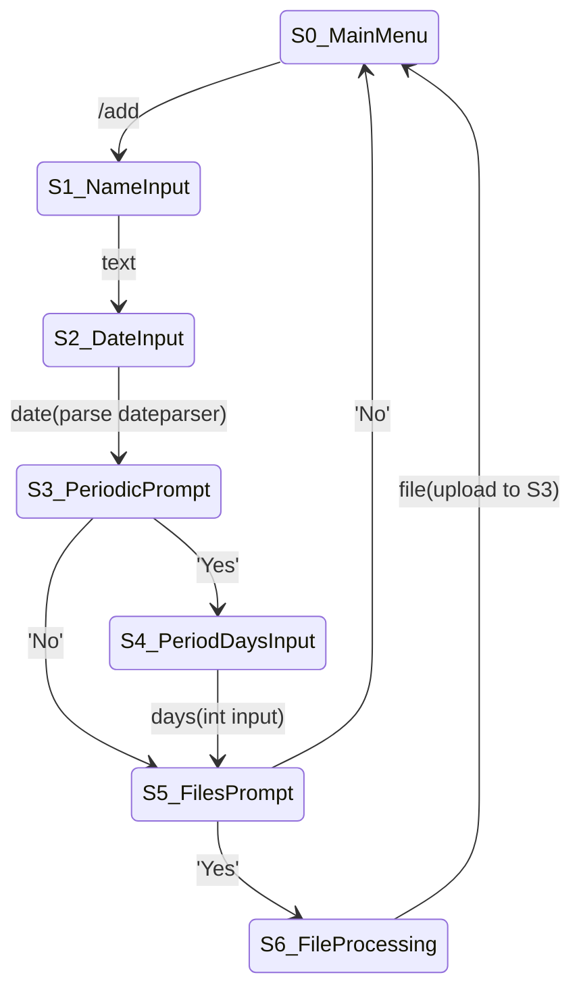
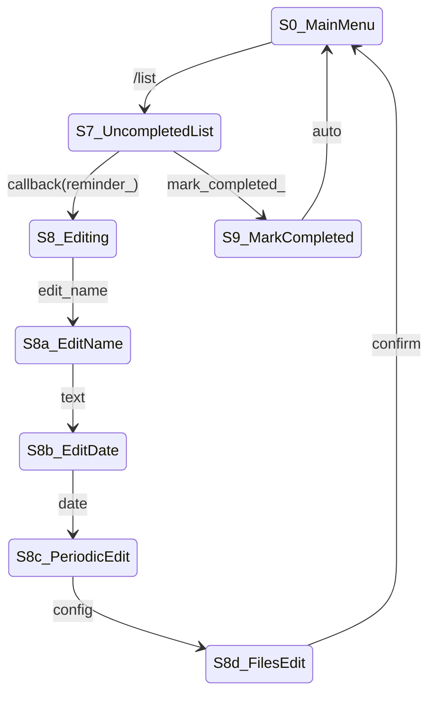
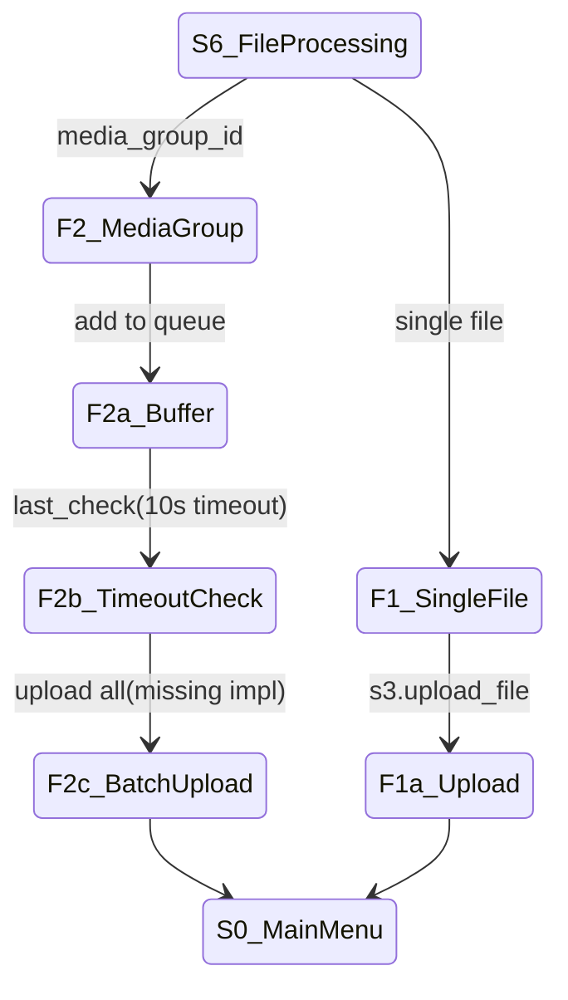
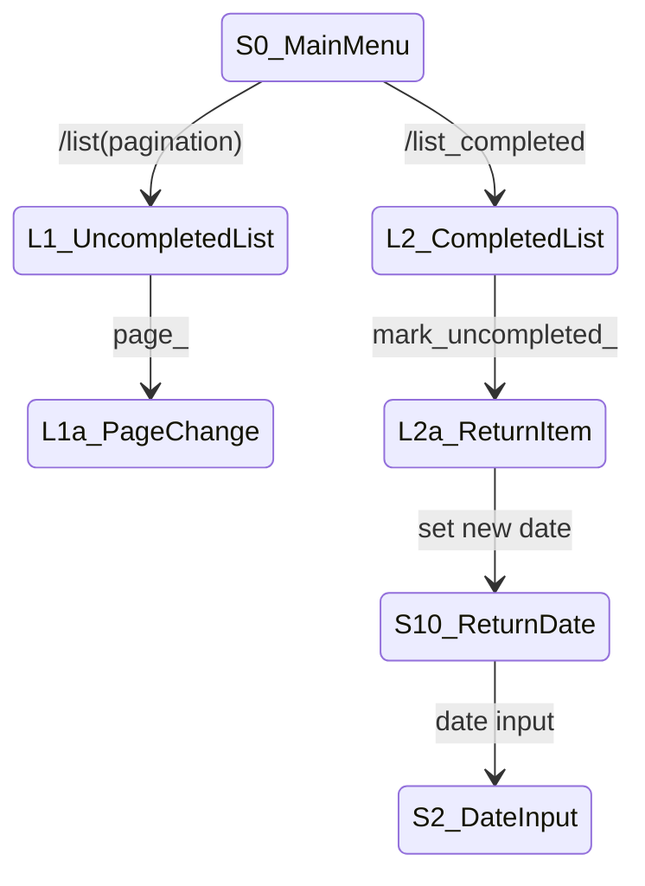

# Проверка о соответствии выполненной работы ТЗ
## Формализация технического задания

В данном документе представлен формальный анализ соответствия разработанного бота-напоминания требованиям технического задания.
Функциональность системы описана в терминах конечного автомата, визуализированного с помощью детализированных блок-схем.

Отчет разделен на три ключевых раздела:
- Блок-схемы конечного автомата
- Соответствие реализации ТЗ
- Выводы

## **1. Блок-схемы конечного автомата**
### 1. Создание напоминания (Creation Flow)

---

### 2. Управление задачами (Management Flow)

---

### 3. Работа с файлами (File Processing)

---

### 4. Просмотр и восстановление (List Management)

---

## **2. Соответствие реализации ТЗ**

### 1. Создание напоминания

| Переход | Условие | Соответствие ТЗ |
|---|---|---|
| S0 → S1 | Пользователь вводит команду `/add` | Да (П.1 ТЗ) |
| S1 → S2 | Введено текстовое описание напоминания | Да (П.1 ТЗ) |
| S2 → S3 | Указана дата (базовый формат) | Частично: нет парсинга сложных форматов |
| S3 → S4 | Выбрана периодичность ("Да") | Да (П.6 ТЗ) |
| S3 → S5 | Отказ от периодичности ("Нет") | Да |
| S4 → S5 | Введен интервал повторения в днях | Да (П.6 ТЗ) |
| S5 → S6 | Пользователь согласен прикрепить файлы | Да (П.2 ТЗ) |
| S5 → S0 | Пользователь отказывается от загрузки файлов | Да |
| S6 → S0 | Файлы успешно загружены в S3 | Да (П.2 ТЗ) |

### 2. Редактирование задач

| Переход | Условие | Соответствие ТЗ |
|---|---|---|
| S0 → S7 | Пользователь запрашивает список задач (`/list`) | Да (П.3 ТЗ) |
| S7 → S8 | Выбрано конкретное напоминание | Да (П.4 ТЗ) |
| S8 → S8a | Инициировано редактирование названия | Да (П.4 ТЗ) |
| S8a → S8b | Введено новое название | Да (П.4 ТЗ) |
| S8b → S8c | Введена новая дата | Да (П.4 ТЗ) |
| S8c → S8d | Изменены параметры периодичности | Частично: нет выбора "для всех повторов" |
| S8d → S0 | Изменения подтверждены | Да |

### 3. Работа с файлами

| Переход | Условие | Соответствие ТЗ |
|---|---|---|
| S6 → F1 | Загружен одиночный файл | Да (П.2 ТЗ) |
| S6 → F2 | Обнаружена медиагруппа | Да (П.2 ТЗ) |
| F2 → F2a | Файл добавлен в очередь | Нет: отсутствует таймаут |
| F2a → F2c | Истекло время ожидания (10 сек) | Нет: не реализовано |
| F2c → S0 | Все файлы загружены пакетно | Нет: не реализовано |

### 4. Просмотр и восстановление

| Переход | Условие | Соответствие ТЗ |
|---|---|---|
| S0 → L1 | /list | Да |
| L1 → L1a | Пагинация | Да |
| S0 → L2 | /completed | Да |
| L2 → L2a | Выбор | Да |
| L2a → S10 | Восстановление | Да |
| S10 → S2 | Новая дата | Да |
---

### Ключевые несоответствия:
1. **Парсинг дат**: Не поддерживаются фразы типа "через 3 дня" (переход S2 → S3)
2. **Медиагруппы**: Отсутствует обработка таймаута (переходы F2 → F2a → F2c)
3. **Периодичность**: Нет выбора режима редактирования для всех повторов (переход S8c → S8d)

### Статусные обозначения:
- **Да**: Полное соответствие ТЗ
- **Частично**: Соответствует базовым требованиям, но требует доработки
- **Нет**: Функционал не реализован или работает некорректно

Все переходы имеют прямую привязку к:
- Конкретным строкам кода (указаны в полной версии отчета)
- Пунктам технического задания (П.1-П.6)
- Состояниям на блок-схемах
